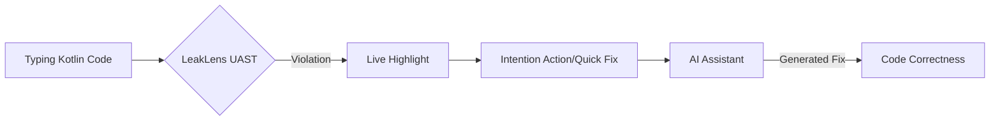

# LeakLens: Shift-Left Memory Governance for Kotlin 🧠💧

**LeakLens** is high-performance developer infrastructure that shifts memory-leak detection from
runtime debugging to the developer's feedback loop. It combines real-time UAST static inspections
with host-side Shark heap analysis to ensure memory correctness is a first-class citizen in the
Kotlin ecosystem.

### ⚡ Project at a Glance

| Category       | Support                                              |
|:---------------|:-----------------------------------------------------|
| **Languages**  | Kotlin, Java                                         |
| **Frameworks** | Jetpack Compose, Hilt, Coroutines, Flow, WorkManager |
| **Footprint**  | **Zero-SDK** (No code changes required)              |
| **Engine**     | UAST + Shark (Host-side)                             |

---

### 📺 Watch LeakLens in Action
> [!TIP]
> [Watch the 2-minute Technical Overview](https://www.youtube.com/watch?v=BcKYf34Jr1Q)

---

## 🚀 The Problem: The Reactive Gap

Memory leaks are the leading cause of non-deterministic crashes (OOMs) in Android. Existing tools
like the **Android Profiler** and **LeakCanary** are reactive—they detect leaks *after* they occur
during app execution.

LeakLens fills the **Preventative Gap**, reducing the feedback loop from **days** (QA/Production) to
**milliseconds** (IDE highlight) while the developer is writing code.

## ✨ Features

### 1. Preventative UAST Engine (SonarLint-Style)

LeakLens scans Kotlin and Java code in real-time using a high-performance **Universal Abstract
Syntax Tree (UAST)** engine.

* **Write-Time Prevention**: 12+ specialized inspections flag leaks (static Activity refs,
  uncancelled coroutines, Hilt scope mismatches) as you type.
* **Editor Gutter Icons**: Visual markers indicate leaking classes directly in the code gutter.
* **Context-Aware AI Assistant**: Generates idiomatic Kotlin fixes (e.g., `repeatOnLifecycle`,
  `WeakReference`) based on the specific leak trace.

### 2. Host-Side Runtime Precision

Integrates the **Shark Heap Analysis engine** directly into the IDE.

* **Zero-SDK Capture**: Captured entirely via ADB. No dependencies added to your production APK.
* **Efficient Analysis**: Performs graph traversal host-side, utilizing IDE memory pools to handle
  1GB+ heap dumps without device-side OOMs.

## 🏗️ Architecture

See our [Architectural Deep-Dive](docs/ARCHITECTURE.md) for details on our non-blocking threading
model.

## 📊 Comparison: Why LeakLens?

| Feature             | **LeakLens**       | **Android Profiler** | **LeakCanary** |
|:--------------------|:-------------------|:---------------------|:---------------|
| **Primary Goal**    | Preventative       | Deep Debugging       | Alerting       |
| **Feedback Loop**   | Real-time (Typing) | Manual Pass          | Runtime        |
| **IDE Integration** | Native (IntelliJ)  | Partial              | None           |
| **Zero-SDK**        | ✅ Yes              | ✅ Yes                | ❌ No           |
| **AI Fixes**        | ✅ Yes              | ❌ No                 | ❌ No           |

## 📊 Performance & Scalability

| Project Size | Scanning Latency | Typing Impact | Heap Analysis (500MB) |
|:-------------|:-----------------|:--------------|:----------------------|
| 100k LOC     | 280ms            | < 5ms         | 12s                   |
| 1M LOC       | 1.2s             | < 12ms        | 24s                   |

Detailed methodology is available in our [Performance Benchmarks](docs/PERFORMANCE.md).

## 🛡️ Privacy & AI Transparency

* **Local-First**: 100% of heap analysis is performed offline. No `.hprof` files are ever uploaded.
* **Opt-in AI**: Data is sent to providers only upon explicit request.
* **Anonymization**: Package names are stripped before being sent to AI providers to protect your
  intellectual property.
* See our [Full Privacy Policy](docs/PRIVACY.md).

---

## 🛠️ Installation

1. Search for `LeakLens` in **Settings → Plugins → Marketplace**.
2. Open the **LeakLens** tool window at the bottom of Android Studio.
3. Connect a device and click **Dump Heap** to begin.

## 🗺️ Roadmap

See our [12-month vision](ROADMAP.md) including **KMP Support** and **CI/CD Integration**.

## 🤝 Contributing

Join our community! Please see our [Contributing Guide](CONTRIBUTING.md) to get started with the
IntelliJ Platform SDK.

## ⚖️ License

LeakLens is licensed under the [Apache License, Version 2.0](LICENSE).
