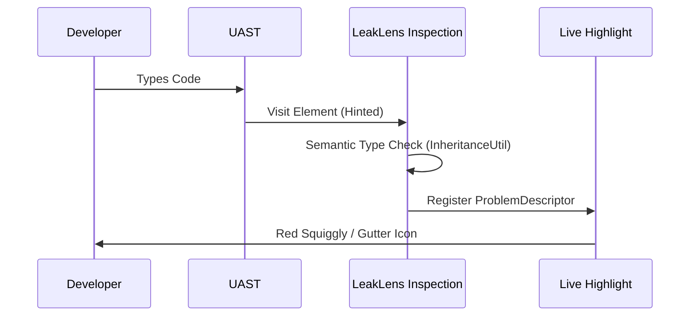

# Architecture

LeakLens is an IntelliJ Platform plugin that performs host-side Android heap analysis. It utilizes a
multi-layered approach to balance deep graph analysis with IDE responsiveness.

## 1. High-Level Data Flow

```mermaid
graph TD
    subgraph "IntelliJ Platform (IDE)"
        Editor[Editor Interaction] --> UAST[UAST Engine]
        UAST --> Insp[LeakLens Inspections]
        Insp --> Gutter[Gutter Icons & Squiggles]
        Insp --> Dashboard[Live Leak Dashboard]
    end

    subgraph "Android Infrastructure"
        ADB[AdbHeapDumpService] --> Device[Android Device/Emulator]
        Device --> Hprof[Heap Dump (.hprof)]
    end

    Hprof --> Shark[Shark Analysis Service]
    Shark --> Dashboard
    Dashboard --> AI[AI Fix Assistant]
```

## 2. Zero-SDK Host-Side Analysis

LeakLens performs heap analysis on the developer machine (Host) rather than the mobile device.

### Benefits:

* **APK Integrity**: No code or dependencies are added to the production APK.
* **Resource Efficiency**: Heap analysis is CPU and memory-intensive. Offloading this to the host
  preserves device battery and prevents device-side OOMs.
* **Shark Engine**: Uses the **Shark** engine directly within the IDE process, leveraging local
  memory pools for large dump processing.

## 3. UAST Static Analysis

LeakLens uses the **Universal Abstract Syntax Tree (UAST)** to provide real-time feedback that is
language-agnostic (Kotlin/Java) and semantically aware.

### Implementation Details:

* **Hinted Visitors**: Achieves low typing latency by using hinted visitors that only trigger for
  specific nodes (e.g., `UField`, `UCallExpression`), avoiding full tree traversals.
* **Semantic Resolution**: Resolves inheritance hierarchies to identify `Context` or `Activity`
  references regardless of class naming or abstraction levels.



## 4. Kotlin-Specific Intelligence

LeakLens identifies memory-unsafe patterns unique to modern Kotlin syntax that generic profilers
often overlook:

* **Lifecycle-Safe Flows**: Analyzes `Flow` collection chains. If it detects a `.collect` inside a
  `lifecycleScope.launch` that is not wrapped in `repeatOnLifecycle` or `flowWithLifecycle`, it
  flags it as a potential leak.
* **Compose Context Escaping**: Scans `@Composable` functions for unstable `Context` captures in
  `remember { }` blocks or when passed into long-lived objects like `ViewModels`.
* **Property Delegates**: Traces retention paths created by delegates like `by lazy` or
  `by viewModels()` to ensure they do not capture lifecycle-bound references.

## 5. Internal Service Layout

LeakLens follows the modern IntelliJ Platform service-oriented architecture:

* **`LeakLensProjectService`**: Central state manager using `StateFlow` to synchronize inspections
  and the tool window.
* **`SharkAnalysisService`**: Encapsulates the Shark engine and manages hprof parsing.
* **`SourceNavigationService`**: Resolves class names and trace elements to source positions via
  `ReadAction.nonBlocking`.
* **`AdbHeapDumpService`**: Orchestrates ADB commands via `GeneralCommandLine` with an adaptive
  reflection layer for cross-IDE compatibility.

## 6. Threading Model

To ensure a responsive UI, LeakLens offloads heavy tasks to specific coroutine dispatchers:

* **`Dispatchers.Default`**: Graph traversal and Shark processing.
* **`Dispatchers.IO`**: ADB commands and report serialization.
* **`EDT (Event Dispatch Thread)`**: UI updates and gutter icon registration.

## 7. AI-Assisted Fixes

The AI Fix Assistant uses prompt engineering to provide idiomatic Kotlin suggestions. It is designed
to explain the root cause and recommend modern patterns (e.g., `WeakReference` delegates or
`LifecycleObserver`) rather than simple null checks.

## 8. Extension Points 🔌

* **`StaticAnalysis`**: Add new `LocalInspectionTool` classes in the `inspections/` package.
* **`FixSuggestions`**: Add rules to `FixSuggestionEngine.kt` for specific trace patterns.
* **`UI Panels`**: Add tabs to `LeakLensMainPanel.kt` using standard `JBTabbedPane` components.
