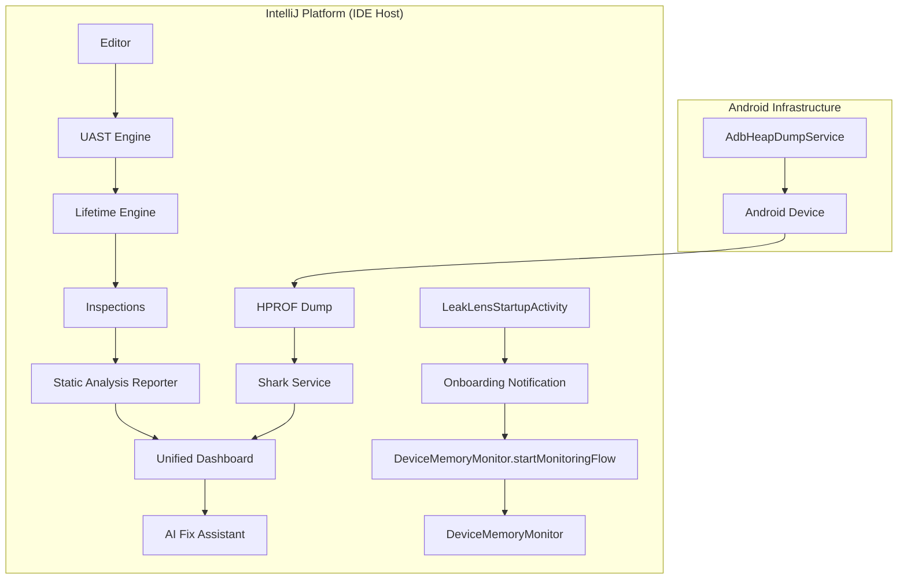

# Architecture

LeakLens is an IntelliJ Platform plugin designed for unified Android memory analysis. It balances
deep object graph traversal with IDE responsiveness through a multi-service architecture powered by
a semantic engine.

## 1. High-Level Data Flow

## 2. Host-Side Analysis (Zero-SDK)

LeakLens runs the **Shark** engine directly within the IDE process. This offloads the CPU and
memory-intensive work of heap parsing from the mobile device to the workstation.

* **Connectivity**: Uses raw ADB shell commands (`am dumpheap`) to trigger dumps on debuggable
  processes.
* **Performance**: Graph traversal is performed using the JVM's local heap, avoiding device-side
  OOMs.
* **Monitoring**: `DeviceMemoryMonitor` provides real-time heap tracking. The
  `startMonitoringFlow()` method centralizes device and process discovery, allowing it to be invoked
  from both tool window actions and onboarding notifications.

## 3. UAST & Semantic Lifetime Analysis

LeakLens leverages **Universal Abstract Syntax Tree (UAST)** and a custom **Lifetime Engine** to
provide real-time feedback.

* **Lifetime Engine**: Maps code constructs (Hilt scopes, Android components, Compose remember
  blocks) to a prioritized `Lifetime` enum.
* **Risk Assessment**: Detections are based on priority comparisons (e.g., a `SINGLETON` holding an
  `ACTIVITY` reference).
* **Resolution**: Uses `InheritanceUtil` and PSI indices to resolve type hierarchies accurately.

## 4. Modern Android Patterns

The plugin includes specialized logic for frameworks that standard profilers often miss:

* **Jetpack Compose**: Detects `Context` capture in `@Composable` scopes and `remember` blocks using
  `getComposeConstructLifetime`.
* **Coroutines & Flow**: Identifies unsafe collection patterns (missing `repeatOnLifecycle`) and
  captures in long-lived scopes like `GlobalScope`.
* **Hilt**: Validates scoping consistency by comparing the `Lifetime` of injecting and injected
  components.
* **ViewModels & Workers**: Detects lifecycle-heavy references (Activity/View) retained in ViewModel
  or Worker fields.

## 5. Threading & Concurrency

To maintain a lag-free UI, LeakLens follows the IntelliJ threading model:

* **`ReadAction.nonBlocking`**: Used for PSI navigation and class resolution.
* **`Task.Backgroundable`**: Wraps long-running ADB and Shark operations.
* **`StateFlow`**: Synchronizes analysis results from `LeakLensProjectService` to the Tool Window
  UI.
* **Persistent State**: `LeakLensPluginState` (App-level) and `LeakLensSettingsState` (
  Project-level) manage configuration and onboarding status across IDE sessions.

## 6. Unified Findings Dashboard

Static analysis issues and runtime heap leaks are consolidated into a `UnifiedIssue` model. This
allows developers to see the "why" (static analysis evidence) alongside the "what" (runtime heap
trace).

## 7. AI Fix Assistant

The remediation layer utilizes LLMs to transform reference chains and semantic evidence into code
fixes. By providing the AI with structured lifetime data (e.g., "Owner: VIEWMODEL, Referenced:
ACTIVITY"), LeakLens produces highly accurate, idiomatic Kotlin suggestions.
