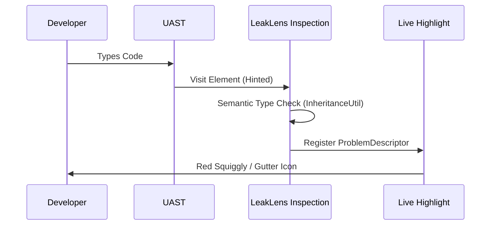
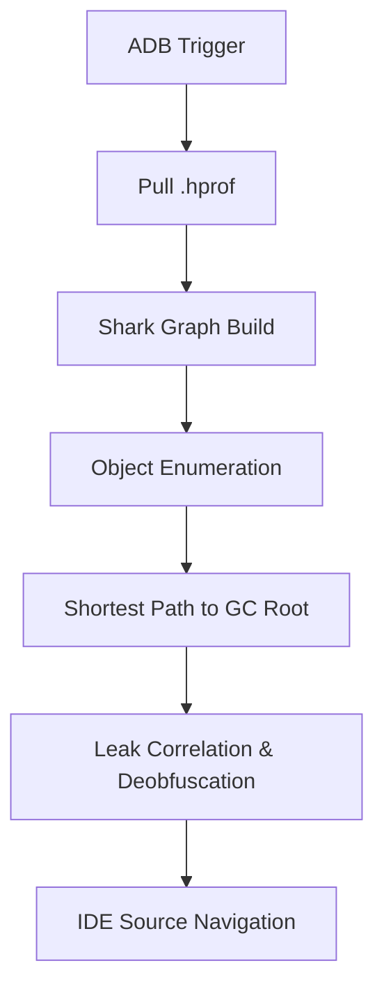
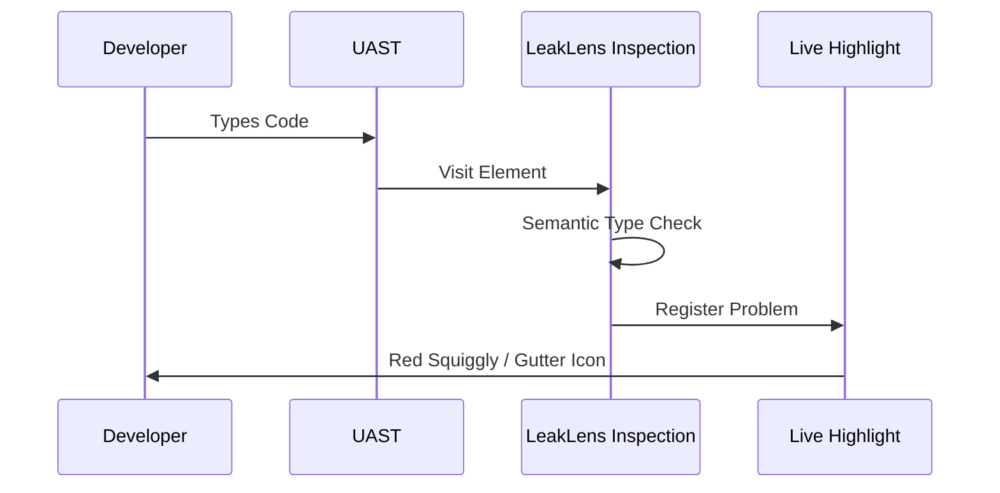
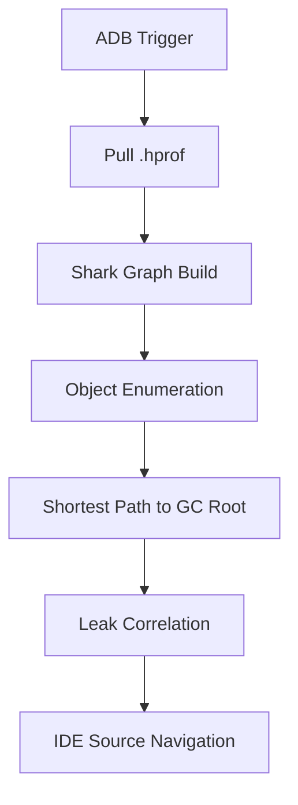

# LeakLens Architectural Deep-Dive 🏗️

LeakLens is designed as high-leverage developer infrastructure. It utilizes a multi-layered approach
to ensure the IDE remains responsive while performing complex graph analysis.

## 1. High-Level Data Flow

```mermaid
graph TD
    subgraph "IntelliJ Platform (IDE)"
        Editor[Editor Interaction] --> UAST[UAST Engine]
        UAST --> Insp[LeakLens Inspections]
        Insp --> Gutter[Gutter Icons & Squiggles]
        Insp --> Dashboard[Live Leak Dashboard]
    end

    subgraph "Android Infrastructure"
        ADB[AdbHeapDumpService] --> Device[Android Device/Emulator]
        Device --> Hprof[Heap Dump (.hprof)]
    end

    Hprof --> Shark[Shark Analysis Service]
    Shark --> Dashboard
    Dashboard --> AI[AI Fix Assistant]
```

## 2. Shift-Left Feedback Loop (Static Analysis)

The static analysis layer uses **UAST (Universal Abstract Syntax Tree)** hinted visitors. By
specifying the `UField` or `UCallExpression` class hints, we achieve $O(1)$ amortized typing latency
even on massive projects.



## 3. Runtime Analysis Engine (Shark Bridge)

LeakLens performs the heavy lifting on the developer machine (Host), not the mobile device.



## 4. Internal Service Layout

LeakLens follows JetBrains' modern service-oriented architecture:

* **`LeakLensProjectService`**: The central state manager using `StateFlow` to synchronize between
  inspections and the tool window.
* **`SharkAnalysisService`**: Encapsulates the Shark engine and manages large-file cancellation.
* **`SourceNavigationService`**: Uses `ReadAction.nonBlocking` to resolve class names to source
  positions without freezing the UI.
* **`AdbHeapDumpService`**: Orchestrates ADB commands via `GeneralCommandLine` with a custom
  reflection layer for cross-IDE version compatibility.

The static analysis layer uses **UAST (Universal Abstract Syntax Tree)** hinted visitors. By
specifying the `UField` or `UCallExpression` class hints, we achieve $O(1)$ amortized typing latency
even on massive projects.



## 3. Host-Side Runtime Analysis

Unlike device-side tools, LeakLens performs the heavy lifting on the developer machine (Host).



## 4. Internal Service Layout

LeakLens follows JetBrains' modern service-oriented architecture:

* **`LeakLensProjectService`**: The central state manager using `StateFlow` to synchronize between
  inspections and the tool window.
* **`SharkAnalysisService`**: Encapsulates the Shark engine and manages large-file cancellation.
* **`SourceNavigationService`**: Uses `ReadAction.nonBlocking` to resolve class names to source
  positions without freezing the UI.
* **`AdbHeapDumpService`**: Orchestrates ADB commands via `GeneralCommandLine`.

## 5. Non-Blocking Threading Model

...

## 6. Extension Points for Contributors 🔌

LeakLens is designed to be extensible. Contributors can plug into these areas without modifying the
core analysis pipeline:

* **`StaticAnalysis`**: Add new `LocalInspectionTool` classes in the `inspections/` package.
* **`FixSuggestions`**: Add rules to `FixSuggestionEngine.kt` to provide customized fixes for unique
  trace patterns.
* **`UI Panels`**: Add new tabs to the `LeakLensMainPanel.kt` using standard `JBTabbedPane`
  components.
