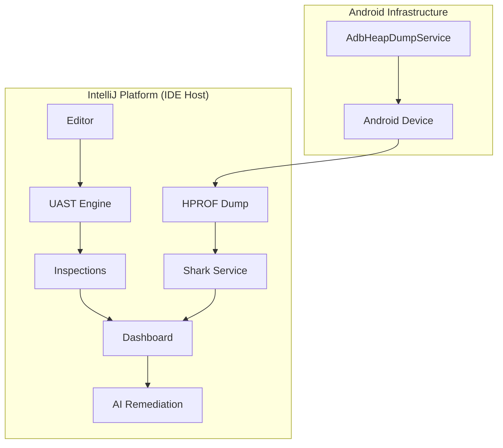

# Architecture

LeakLens is an IntelliJ Platform plugin designed for host-side Android heap analysis. It balances
deep object graph traversal with IDE responsiveness through a multi-service architecture.

## 1. High-Level Data Flow

## 2. Host-Side Analysis (Zero-SDK)

LeakLens runs the **Shark** engine directly within the IDE process. This offloads the CPU and
memory-intensive work of heap parsing from the mobile device to the workstation.

* **Connectivity**: Uses raw ADB shell commands (`am dumpheap`) to trigger dumps on debuggable
  processes.
* **Performance**: Graph traversal is performed using the JVM's local heap, avoiding device-side
  OOMs common when analyzing large applications.

## 3. UAST Static Analysis

LeakLens leverages **Universal Abstract Syntax Tree (UAST)** to provide real-time feedback during
code authoring.

* **Performance**: Implements `HintedVisitorAdapter` to target specific nodes (fields, method
  calls), minimizing the overhead on the IDE's highlighting thread.
* **Resolution**: Uses `InheritanceUtil` and PSI indices to resolve type hierarchies, ensuring
  accurate detection of `Context` or `Activity` leaks regardless of class names.

## 4. Modern Android Patterns

The plugin includes specialized logic for frameworks that standard profilers often miss:

* **Jetpack Compose**: Scans for `Context` capture in `@Composable` scopes and `remember` blocks.
* **Coroutines/Flow**: Detects unsafe collection patterns (e.g., missing `repeatOnLifecycle`).
* **Hilt**: Validates scoping consistency (e.g., verifying that `@Singleton` components don't inject
  Activity-bound dependencies).

## 5. Threading & Concurrency

To maintain a lag-free UI, LeakLens strictly follows the IntelliJ threading model:

* **`ReadAction.nonBlocking`**: Used for PSI navigation and class resolution.
* **`Task.Backgroundable`**: Wraps long-running ADB and Shark operations.
* **`StateFlow`**: Synchronizes analysis results between the backend services and the Tool Window
  UI.

## 6. AI Fix Engine

The remediation layer utilizes LLMs to transform Shark's reference chains into code fixes. It is
optimized to recognize idiomatic Kotlin patterns, such as converting leaking properties into
`WeakReference` delegates or `Lifecycle` observers.
